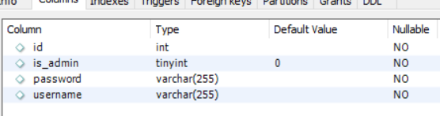
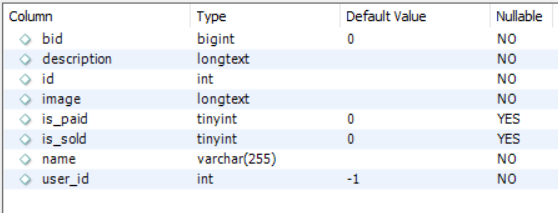
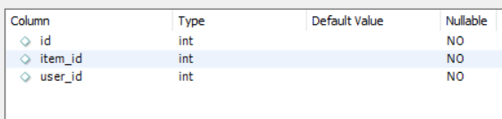

# AuctionSystem
 Basic Auction System using JavaFx

## Requirements (The versions used)
The project would probably work for other versions, but it has been developed using these versions

> openjdk 16
> 
> [mysql-connector-java-8.0.25](https://dev.mysql.com/downloads/connector/j/)

## Setup
Used MySQL database for storing information. 
Made use of MySQL 8.0.

The database constants must be defined in the DB_CONSTANTS class of application.CONSTANTS package
The classname is not required now, removing it shouldn't cause any problems.

#### ***Also, set up the constants in PATH class, in the applications.CONSTANTS package (This needs to be removed by TODO #1)***

###### The tables used, and their column attribute are as follows:
_Table "accounts"_

_Table "items"_

_Table "transaction"_

**Note:** All the "id" columns (there's one in each table) must be set to auto increment

#### To do

* Store images in the database directly, instead of storing it in the files

